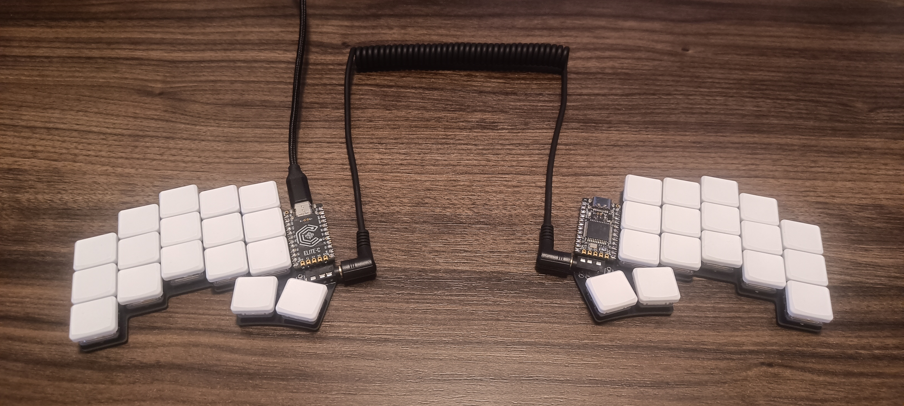
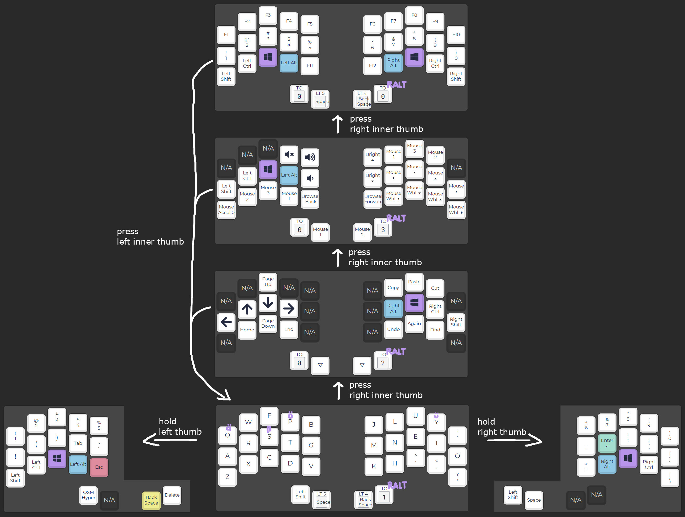

# custom-keyboard

Resources to build a Ferris Sweep keyboard and customize it

## Hardware — Building the Ferris Sweep

1. Customize PCB
   - tutorial: https://www.youtube.com/watch?v=JqpBKuEVinw
   - repo: https://github.com/christianwaldmann/Sweep
2. Buy PCB
   - upload Gerber file to https://jlcpcb.com/ and order PCB
3. Buy other parts
   - potential sites:
      - https://splitkb.com/
      - https://www.diykeyboards.com/ (also on etsy)
   - parts:
      - 34x switches: laih low profile choc switches (pink)
      - 34x keycaps: blank mbk choc low profile keycaps
      - 2x sockets: mill max low profile sockets
      - 2x trrs jack
      - 1x braided trrs cable
      - 1x usb-c cable
      - 2x elite-c controller
4. Soldering parts
   - walkthrough: https://www.youtube.com/watch?v=fBPu7AyDtkM
   - tips: https://docs.splitkb.com/product-guides/aurora-series/build-guide/microcontrollers

## Steps to build and flash firmware

At the example of flashing a Colemak DH-based layout onto the Ferris Sweep:

1. Prepare environment
    1. Install qmk, for example: `yay qmk`
    2. Run setup: `qmk setup`
2. Compile keymap layout with `./scripts/compile.sh`
3. Flash compiled firmware onto keyboard
    1. Connect 1 half of the keyboard to the PC (remove all other cables)
    2. Enter bootloader mode with the reset button (can also use some wire/paper clip to do this)
    3. Flash firmware: `./scripts/flash.sh`
    4. Repeat steps for the other half of the keyboard
4. Finished. You can now connect all cables of the keyboard and it should work

## Keymap Layout

This layout is based on Colemak DH and assumes the OS is configured to use the "US International" layout.

## Useful links

- learn new layout: https://monkeytype.com/
- test keys: https://config.qmk.fm/#/test/
- Colemak DH layout for Ferris Sweep
  - blog post: https://franknoirot.co/posts/ferris-sweep-keyboard-layout/
  - repo: https://github.com/franknoirot/kit/
- QMK tutorial: https://docs.qmk.fm/newbs_getting_started
